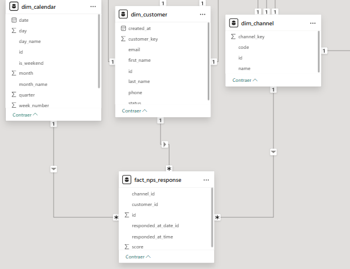
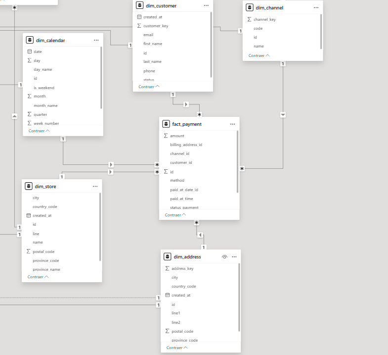
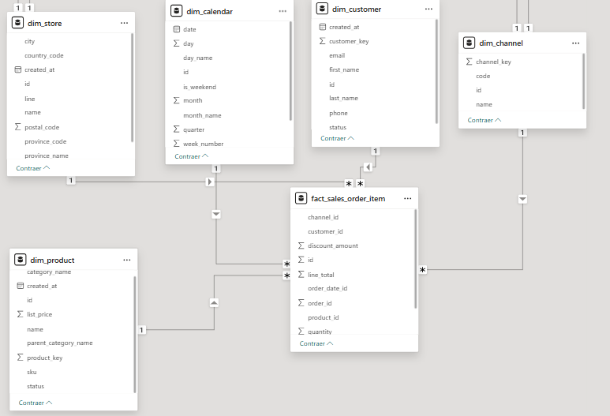
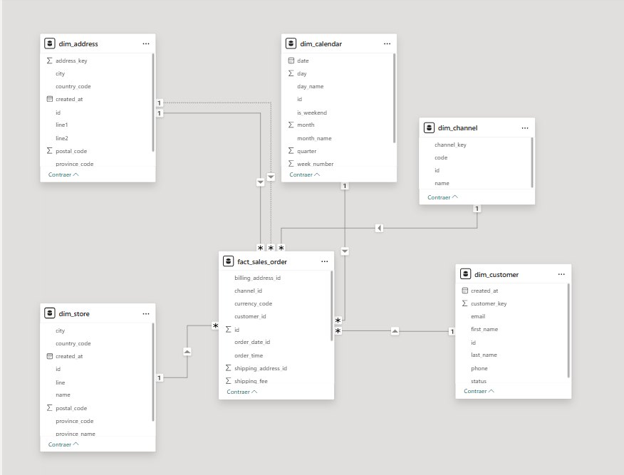
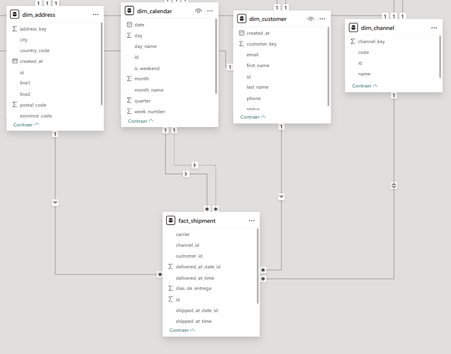
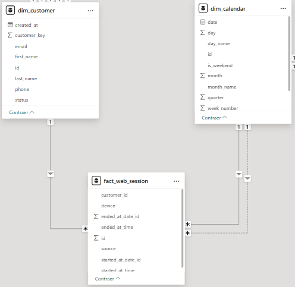

# Trabajo Práctico Final — Introducción al Marketing Online y los Negocios Digitales


🚀 Proyecto Final: Mini-Ecosistema de Datos Comercial (Online + Offline)
🎯 Objetivo del Proyecto
El objetivo de este proyecto es diseñar e implementar un mini-ecosistema de Data Warehouse (DW) utilizando el esquema estrella de Kimball a partir de datos transaccionales (RAW). Este DW permite la construcción de un dashboard de reporte para el área comercial con KPIs clave para la toma de decisiones.

---

**Consigna y documento principal:** [Trabajo Práctico Final](https://docs.google.com/document/d/15RNP3FVqLjO4jzh80AAkK6mUR5DOLqPxLjQxqvdzrYg/edit?usp=sharing)
**Diagrama Entidad Relación:** [DER](./assets/DER.png)

---

## 📈 **KPIs Clave Soportados**
El modelo de datos desarrollado soporta el cálculo de los siguientes indicadores de desempeño:

**KPIDefiniciónTotal Ventas**: ($M)Suma de total_amount (status: PAID o FULFILLED), filtrable por canal y período.

**Usuarios Activos**: (nK)Conteo de customer_id distintos en web_session por período.

**Ticket Promedio**: ($K)SUM(total_amount) / COUNT(pedidos) (mismo filtro que Ventas).

**NPS**: (Net Promoter Score)((% Detractores) - (% Promotores)) * 100 sobre nps_response.

**Ventas por Provincia**: Agrupación de total_amount por la provincia de la dirección de envío (shipping_address_id).

**Ranking Ventas por Producto**:Agrupación de line_total de ítems por product_id y mes.

---
## Tabla de hechos y dimensiones 
**Hechos: (Facts)**: fact_sales_order, fact_sales_order_item, fact_payment, fact_shipment, fact_nps_response, fact_web_session.
(6 en total)

**Dimensiones (Dims)**: dim_calendar, dim_customer, dim_product, dim_address, dim_channel, dim_store.
(6 en total)

**Los datos originales se encuentran en la carpeta raw/, donde se aplicaron transformaciones para llevar a las tablas del DW**

---

## Luego de forkear en github Clonamos el repositorio a nuestra pc.

```bash
# 1. CLONAR EL REPOSITORIO
# Navega al directorio deseado y clona el proyecto
git clone https://www.youtube.com/watch?v=eQMcIGVc8N0
```
## Muy importante estar en el directorio correcto(se llega usando la consola)
```bash
# Entra al directorio del proyecto
cd mkt_tp_final/
```
## Creando el entorno virtual
```bash
# 2. CREAR Y ACTIVAR ENTORNO VIRTUAL (Recomendado)
# Crea el entorno
python -m venv venv
``` 
## Como activar entorno virtual
```bash
# Activa el entorno
# En Windows (CMD):
venv\Scripts\activate

# En Linux/macOS/Git Bash:
source venv/bin/activate
```
## Paquetes necesarios para instalar
```bash
# 3. INSTALAR PAQUETES NECESARIOS
# Los paquetes principales para el ETL son pandas y dateutil
pip install pandas dateutil
pip insatll numpy
```
## Ayuda para ejecutar el codigo correctamente
```bash
# Asegúrate de que tu entorno virtual esté activo.
# Ejecuta el script de transformación (ETL)
python tp_final.py
# El script lee los datos de la carpeta 'raw/', los transforma
# al modelo estrella y genera todos los archivos CSV del
# Data Warehouse en la carpeta 'dw/'.
```

## Utilizamos comandos para conectarnos con github
```bash
# 1. Agrega todos los archivos modificados y nuevos (incluyendo la carpeta dw/)
git add .

# 2. Confirma los cambios con un mensaje claro y descriptivo
git commit -m "feat: Implementación completa del ETL y modelado final de fechas/direcciones."

# 3. Sube los cambios al repositorio remoto
git push origin main
```

# Relaciónes hechas en mi trabajo

**DIAGRAMA DE NPS_RESPONSE**





**DIAGRAMA DE FACT_PAYMENT**





**DIAGRAMA DE FACT_SALES_ORDER**





**DIAGRAMA DE FACT_SALES_ORDER_ITEM**





**DIAGRAMA DE FACT_SHIPMENT**




**DIAGRAMA DE FACT_WEB_SESSION**





# Explicaciones de los hechos y dimensiones:

## 📊 Tablas de Hechos (Fact Tables)

---

### 1. **fact_sales_order (Pedido)**
**Registra la cabecera de cada orden y sus montos totales.**

- **id:** PK. Identificador único del pedido.  
- **order_date_id:** FK (Tiempo). Fecha de la orden (une a dim_calendar).  
- **order_time:** Hora exacta en que se creó el pedido.  
- **customer_id:** FK. Cliente que realizó la compra.  
- **shipping_address_id:** FK (Rol Dirección). Dirección de Envío (une a dim_address).  
- **billing_address_id:** FK (Rol Dirección). Dirección de Facturación.  
- **total_amount:** Métrica. Monto total final de la orden (KPI Clave de Ventas).  
- **subtotal, tax_amount, shipping_fee:** Componentes monetarios del total.  
- **status_order:** Estado de la orden.  
- **channel_id, store_id:** FKs para canal y tienda.  

---

### 2. **fact_sales_order_item (Ítem del Pedido)**
**Registra cada línea de producto vendida, permitiendo el análisis granular por producto.**

- **id:** PK. ID único de la línea de ítem.  
- **order_id:** FK. Pedido al que pertenece el ítem (une a fact_sales_order).  
- **product_id:** FK. Producto específico vendido (une a dim_product).  
- **order_date_id:** FK (Tiempo). Fecha de la orden.  
- **quantity:** Métrica. Cantidad de unidades vendidas.  
- **line_total:** Métrica. Monto total de esa línea (después de descuento).  
- **unit_price, discount_amount:** Precio unitario y descuento aplicado.  
- **customer_id, channel_id, store_id:** FKs de contexto.  

---

### 3. **fact_payment (Pago)**
**Registra el evento de pago asociado a un pedido.**

- **id:** PK. ID único del pago.  
- **paid_at_date_id:** FK (Tiempo). Fecha en que se registró el pago.  
- **paid_at_time:** Hora exacta del pago.  
- **amount:** Métrica. Monto pagado.  
- **method:** Método de pago utilizado (CARD, CASH, GATEWAY).  
- **status_payment:** Estado del pago (PAID, FAILED).  
- **order_id, customer_id, billing_address_id:** FKs de contexto.  

---

### 4. **fact_shipment (Envío)**
**Registra la duración del proceso logístico desde el envío hasta la entrega.**

- **id:** PK. ID único del registro de envío.  
- **shipped_at_date_id:** FK (Rol T.). Fecha en que fue enviado.  
- **delivered_at_date_id:** FK (Rol T.). Fecha en que fue entregado.  
- **dias_de_entrega:** Métrica. Duración del envío en días.  
- **carrier:** Empresa de transporte (Correo Argentino, PICKUP).  
- **tracking_number:** Código de seguimiento.  
- **customer_id, shipping_address_id:** FKs de contexto.  

---

### 5. **fact_nps_response (Respuesta NPS)**
**Registra la puntuación de lealtad del cliente para calcular el KPI de NPS.**

- **id:** PK. ID único de la respuesta NPS.  
- **responded_at_date_id:** FK (Tiempo). Fecha en que se envió la respuesta.  
- **score:** Métrica. Puntuación NPS (0-10).  
- **customer_id, channel_id:** FKs de contexto.  

---

### 6. **fact_web_session (Sesión Web)**
**Registra la actividad online de los usuarios para medir usuarios activos y tráfico.**

- **id:** PK. ID único de la sesión.  
- **started_at_date_id:** FK (Rol T.). Fecha de inicio de la sesión.  
- **ended_at_date_id:** FK (Rol T.). Fecha de fin de la sesión.  
- **source:** Fuente de tráfico (ads, direct, social).  
- **device:** Dispositivo utilizado (desktop, mobile).  
- **customer_id:** FK. Cliente asociado (puede ser nulo si es anónimo).  

---

## 📐 Tablas de Dimensión (Dimension Tables)
**Estas tablas proporcionan los atributos que describen el contexto (quién, qué, dónde, cuándo).**

---

### 1. **dim_calendar (o dim_date)**
- **id:** PK. Clave subrogada de fecha (usada como FK en todos los hechos).  
- **date:** La fecha completa.  
- **year, month, day_name, quarter:** Atributos para agrupar y filtrar por tiempo.  

---

### 2. **dim_customer**
- **id:** PK. Clave subrogada del cliente.  
- **customer_key:** Clave natural (ID de origen).  
- **first_name, last_name:** Atributos descriptivos del cliente.  
- **email, phone:** Datos de contacto.  
- **status:** Estado del cliente.  

---

### 3. **dim_product**
- **id:** PK. Clave subrogada del producto.  
- **sku, product_key:** Códigos de identificación.  
- **name:** Nombre del producto.  
- **category_name:** Categoría principal (ej. Classic, Sport).  
- **list_price:** Precio de lista original.  

---

### 4. **dim_address**
- **id:** PK. Clave subrogada de la dirección.  
- **line1, city, postal_code:** Componentes de la dirección.  
- **province_name:** Nombre de la provincia (clave para el KPI de Ventas por Provincia).  

---

### 5. **dim_channel**
- **id:** PK. Clave subrogada del canal.  
- **code:** Código corto (ONLINE, OFFLINE).  
- **name:** Nombre descriptivo (Tienda Online, Tiendas Físicas).  

---

### 6. **dim_store**
- **id:** PK. Clave subrogada de la tienda.  
- **name:** Nombre de la tienda física.  
- **city, province_name:** Ubicación de la tienda.  
- **address_id:** Dirección física de la tienda (FK a dim_address).  
